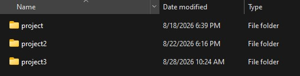
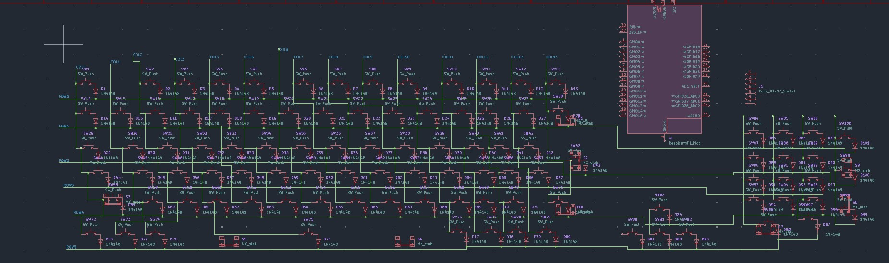
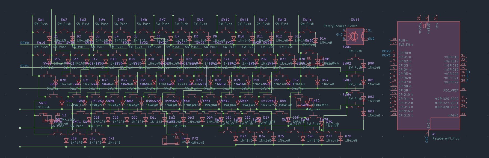
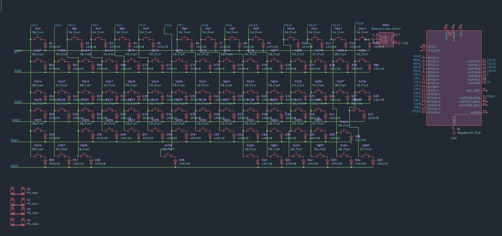
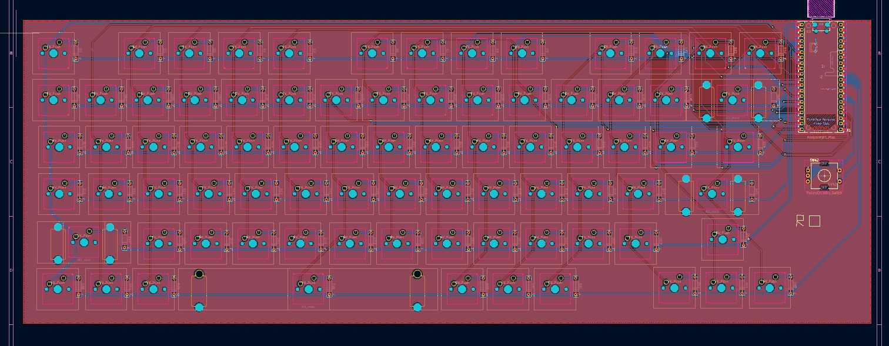
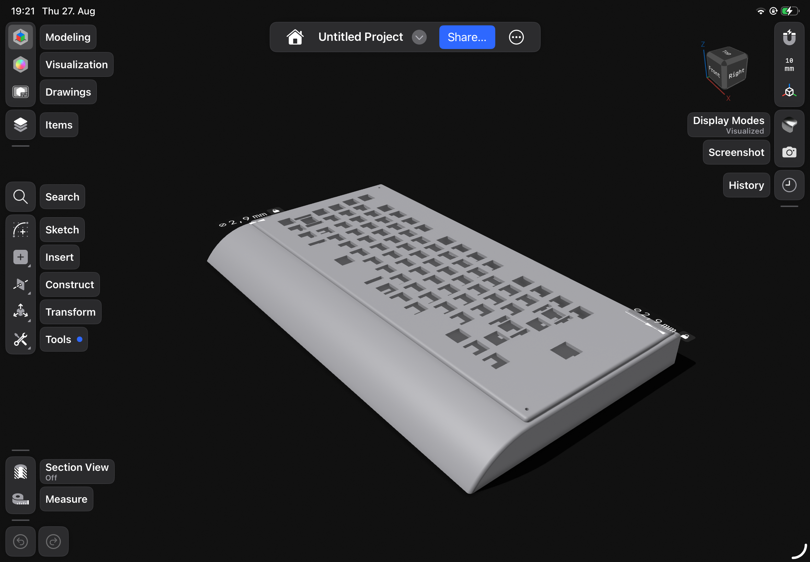

# keyboard

I dont know what to call it so lets call it "keeb" because thats the name  of  the guide

This was my first keyboard , apart from my macropad ,the keyboard took 3 times , more on that on my Journal

## Features
- Us keyboard
- Del key with fn + Backspace
- 75 %
- Made with lots of hate and Caffeine
- Rotary Encoder
## How to assemble
First you go to jlcpcb and uplood the gerber files, i recommend black pcb colors
Then you go to Aliexpress and order all the parts from the BOM

In the meantime while it ships you start printing the Case,if your Printer is too small , half it or you can order it off print legion

Once everything is ready , you grab some solder and an iron , i recommend leaded solder makes it easier,firstly take your pi pico and add the  male pins,then put it trough and solder everything and snap off its legs outside

Then take your diodes,and turn the board around ,make sure the diodes are pointing  down in orientation and solder them,snap off its legs 

Then take your switchs,turn the board around and pit them all in and solder them one by one 

Last but not least ,add the rotary encoder and solder it

Also add the Stabalizers , watch a tiktok to put them togehter

put the ready board in the case add heated inserts and screw it together

add the key caps and youre done with assembly:D

## How to Software 
Set the Pi Pico to its Bootloader and connect it to your pc  take the uf2 zip and unzip , 

move the file to the pi labelled usb driver

thats it have fun! 

## Picture Gallary

 
